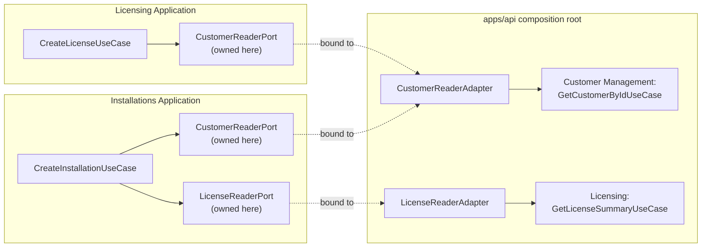

# Control Plane Core (CLOUD-01B)

Status: CLOUD-01B. Introduces the first three real bounded contexts on top of the CLOUD-01A
Foundation (see [overview.md](./overview.md)). No authentication, no payments, no installation
activation - see the "Not implemented" list at the end.

## The three bounded contexts

| Context             | Package                          | Responsibility                                                                                                               |
| ------------------- | -------------------------------- | ---------------------------------------------------------------------------------------------------------------------------- |
| Customer Management | `@pos-cloud/customer-management` | Who the commercial customer is: identity, legal/trade name, ACTIVE/SUSPENDED/INACTIVE lifecycle.                             |
| Licensing           | `@pos-cloud/licensing`           | What a customer is entitled to: license edition/model, commercial validity rules, technical entitlements, license lifecycle. |
| Installations       | `@pos-cloud/installations`       | Where the license is deployed: individual POS installations, their platform, and capacity against a license.                 |

Each is a real, independently-buildable/testable pnpm workspace package under
`libs/control-plane/<context>/`, following the same internal layering as Foundation's ADR-002
(Hexagonal + Clean Architecture):

```
src/
  domain/           entities, value objects, status/transition rules, repository port, errors
  application/      use cases (commands + queries), cross-context reader ports
  infrastructure/   TypeORM persistence records, mappers, repository adapters
  presentation/     HTTP controllers, request/response DTOs
  <context>.module.ts   NestJS module - the package's only Nest-aware "entry" besides presentation
  index.ts          public API - see "Public API" below
```

No empty layer folders exist for a context that doesn't need them (all three currently use all
four).

## Aggregate roots

- **Customer** (Customer Management) - `id`, `code` (unique, normalized), `legalName`,
  `tradeName` (nullable), `status`. No child entities.
- **License** (Licensing) - `id`, `customerId` (logical), `licenseNumber` (unique, normalized),
  `edition`, `licenseModel`, `status`, `validFrom`/`validUntil`, `maxInstallations`, and a child
  entity collection `entitlements: LicenseEntitlement[]` (never loaded/saved independently of its
  License).
- **Installation** (Installations) - `id`, `customerId` (logical), `licenseId` (logical),
  `installationCode` (unique, normalized), `name`, `platform`, `status`, `registeredAt`.

No aggregate root is shared across contexts - see ADR-009.

## Persistence pattern

Every aggregate follows Domain Entity <-> Mapper <-> TypeORM Persistence Record, exactly as
described in [overview.md](./overview.md#dependency-direction-hexagonal--clean-architecture): e.g.
`Customer` / `CustomerMapper` / `CustomerRecord`. No `@Entity()` decorator ever appears on a
Domain class. Value objects (`CustomerCode`, `LicenseNumber`, `InstallationCode`, `EntitlementCode`,
`CustomerName`) each expose a validating `create()` factory and a non-validating `reconstitute()`
factory - the latter used only by mappers reading already-valid data back from PostgreSQL, so a
future tightening of a validation rule can never break loading existing rows.

## Cross-context communication (ports, not database access)

No bounded context imports another's package, persistence record, or repository - enforced by
`tests/architecture` (`*-cannot-import-other-bounded-contexts` rules), not just convention. Two
ports exist, each **owned by its consumer**:

- **`CustomerReaderPort`** - defined independently by both Licensing and Installations (same
  shape, `findCustomerSummary(customerId) => { id, active } | null`), since each bounded context
  owns the port it depends on rather than sharing a type across a context boundary.
- **`LicenseReaderPort`** - defined by Installations,
  `findLicenseSummary(licenseId) => { id, customerId, maxInstallations, usable } | null`. `usable`
  is computed _by Licensing_ (`License.isUsable`, see below) so Installations never has to know
  Licensing's usability rules.



The bindings are wired exactly once, in
[apps/api/src/control-plane/cross-context-ports.module.ts](../../apps/api/src/control-plane/cross-context-ports.module.ts),
a `@Global()` NestJS module - the only place in the repository that imports more than one bounded
context's public API to connect them. Licensing's and Installations' own modules never bind these
tokens themselves; they only declare that they need them (see ADR-009).

## Public API (no deep imports)

Each package's `src/index.ts` exports only: the NestJS module class, use case classes (+ their
command/query input types), cross-context port interfaces/tokens the package owns, the minimal
domain types a consumer legitimately needs (e.g. `Customer`, `CustomerStatus`), and the package's
error classes. Persistence records, mappers, TypeORM repository classes, HTTP controllers, and
DTOs are never exported. This was evaluated against exposing a separate `@pos-cloud/<pkg>/nest`
subpath (as the task brief suggested as an option); a single curated entry point was chosen instead
because this repository's TypeScript `moduleResolution` (`node`, inherited from Foundation, not
changed here) does not resolve package `exports`-based subpaths for types, so a second export
surface would need an on-disk subpath package trick for no real benefit at this stage - the actual
enforcement mechanism is `tests/architecture`'s dependency-cruiser rules operating on real file
paths, not the export surface itself (see `tests/architecture/README.md`).

## Data ownership and schemas

One PostgreSQL schema per bounded context - see
[control-plane-data-model.md](./control-plane-data-model.md) for the full column/constraint list
and ER diagram:

- `control_plane.customers`
- `licensing.licenses`, `licensing.license_entitlements`
- `installations.installations`

Foreign keys only exist **within** a schema (`license_entitlements.license_id ->
licenses.id`). No foreign key crosses a schema boundary - see ADR-010. Cross-context references
(`licenses.customer_id`, `installations.customer_id`, `installations.license_id`) are plain `uuid`
columns with no PostgreSQL-level referential integrity; consistency is the application layer's job
(the ports above), not the database's.

## HTTP API

All business routes live under `/api/v1/control-plane/...`; the existing `/health`, `/health/live`,
`/health/ready` endpoints are unchanged (see [overview.md](./overview.md)).

| Resource      | Routes                                                                                                                                                                      |
| ------------- | --------------------------------------------------------------------------------------------------------------------------------------------------------------------------- |
| Customers     | `POST /api/v1/control-plane/customers`, `GET .../:id`, `GET .../` (paginated), `PATCH .../:id/status`                                                                       |
| Licenses      | `POST /api/v1/control-plane/licenses`, `GET .../:id` (incl. entitlements), `GET .../` (paginated, entitlements omitted), `PATCH .../:id/status`, `PUT .../:id/entitlements` |
| Installations | `POST /api/v1/control-plane/installations`, `GET .../:id`, `GET .../` (paginated), `PATCH .../:id/status`                                                                   |

List endpoints share one pagination contract (`libs/shared-kernel`'s `PaginatedResult`): `page`
(default 1, min 1), `pageSize` (default 25, min 1, max 100), `items`, `total`, `totalPages`. Every
business error uses one consistent contract (`{ statusCode, code, message, correlationId,
details? }`) produced by `apps/api/src/common/all-exceptions.filter.ts`, which maps generically off
the shared-kernel error taxonomy (`NotFoundError` -> 404, `ConflictError` -> 409, `ValidationError`
-> 400) - it never imports a bounded-context-specific error class.

### Installation activation is intentionally not exposed

`Installation.changeStatus` (the administrative status-change use case) cannot reach `ACTIVE` from
`PENDING` - that transition is deliberately excluded from its allowed-transitions table. A separate
domain method, `Installation.activate()`, exists and is fully covered by domain tests, but **no
CLOUD-01B use case calls it** - real activation (installation credentials) is CLOUD-01C's job.

## OpenAPI contract

Generated at runtime from live NestJS/`@nestjs/swagger` decorators - never a static file. In any
non-production environment: Swagger UI at `/docs`, raw document at `/openapi.json`. See
[ADR-011](../adr/ADR-011-openapi-as-contract-with-pos-admin-web.md) for why this is the intended
integration contract with the future `pos-admin-web` frontend (a separate repository/deployable -
not created in this task).

## Microservice extraction seams

Unchanged in spirit from [ADR-001](../adr/ADR-001-modular-monolith-before-microservices.md): all
three contexts stay in-process for CLOUD-01B. What this task adds is a _concrete_ seam - because
cross-context calls already go through an application-layer port with an in-process adapter (never
a direct repository/database call), extracting any one of the three into its own service later
means only:

1. Replacing that context's composition-root adapter registration with an HTTP/gRPC client
   implementing the same port interface.
2. Giving the extracted context its own PostgreSQL database (its schema already has no incoming
   cross-schema FKs to break).
3. Deciding what happens to same-process transactional guarantees it used to get for free (e.g.
   Licensing's `CreateLicense` + entitlements transaction stays intra-service either way, since
   entitlements are same-context).

No context is being extracted now; this section records the seam, not a plan to use it.

## Not implemented in CLOUD-01B

Authentication/admin users/JWT/OAuth, installation activation credentials/heartbeat, Mercado Pago
and all Payment Orchestrator concepts, cloud backup/sync, and `pos-admin-web` itself. See the task
brief's full exclusion list; none of it is present here even as scaffolding.
