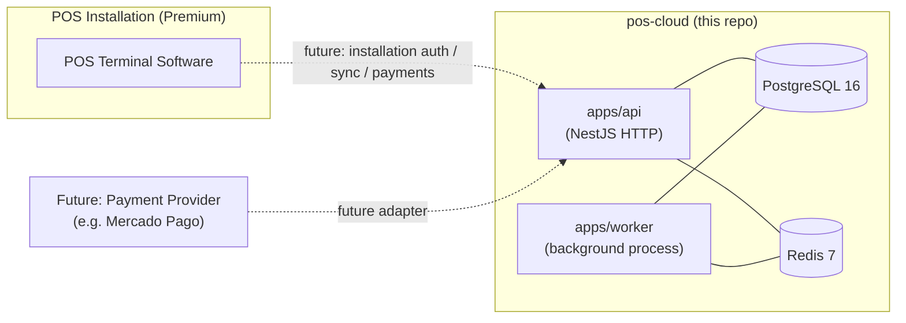
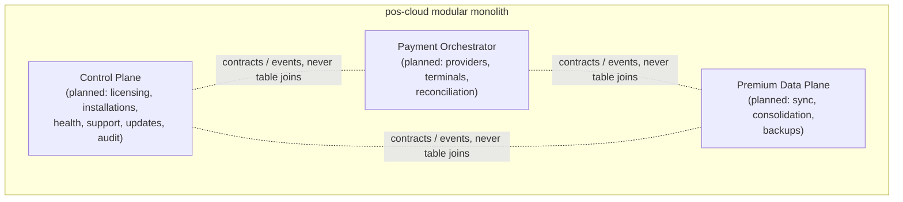
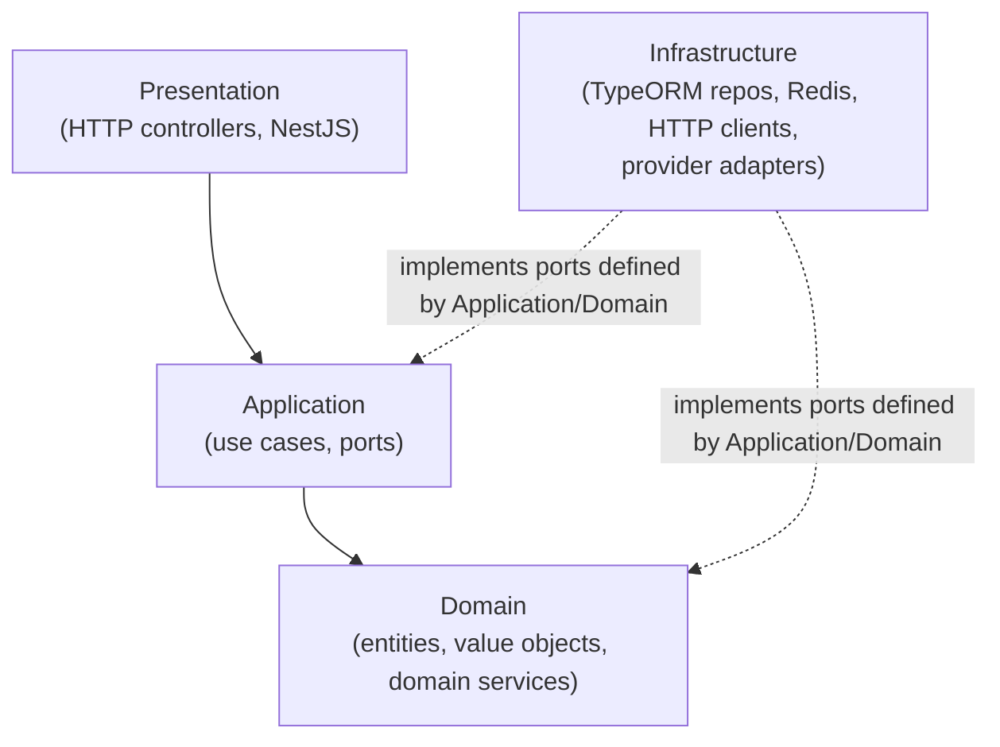
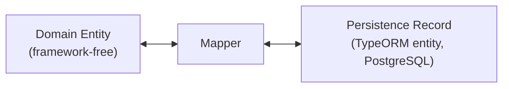

# pos-cloud Architecture Overview

Status: CLOUD-01A (Foundation). No commercial bounded context is implemented yet - this document
describes the shape the system is built to grow into, not features that exist today.

## What pos-cloud is

pos-cloud is the cloud backend for POSPlatform Premium. It is not a Mercado Pago backend; Mercado
Pago is one future adapter behind a Payment Orchestrator port. Over time pos-cloud becomes three
things, built incrementally on the same modular monolith:

1. **Vendor / Admin Control Plane** - licensing, installations, entitlements, support, updates, audit.
2. **Payment Orchestrator** - multi-provider payment terminal integration, provider adapters.
3. **Premium Commerce Data Plane** - backups, sync, consolidation, multi-device operation.

POSPlatform Basic never depends on pos-cloud: it is local-first, SQLite-backed, and fully
functional offline. pos-cloud only matters once a POS installation upgrades to Premium.

## Deployment context (conceptual)

In CLOUD-01A there is no installation-facing contract yet. The diagram shows the seam the next
tasks (CLOUD-01B/C, CLOUD-02, CLOUD-03) will fill in.

## Modular monolith boundaries

Single deployable codebase, multiple bounded contexts, each owning its own data and internal
layering. No bounded context reaches into another's tables or repositories.

No bounded context packages exist yet under CLOUD-01A - this is the target shape for CLOUD-01B
onward.

## Dependency direction (Hexagonal + Clean Architecture)

Rules (enforced by [tests/architecture](../../tests/architecture/README.md) via
dependency-cruiser, not just documentation):

- **Domain** depends on nothing but the language and `libs/shared-kernel`. No NestJS, no TypeORM,
  no PostgreSQL, no Redis, no HTTP, no Axios, no external SDKs.
- **Application** depends on Domain. It may depend on _ports_ (interfaces) but never on a concrete
  Infrastructure implementation.
- **Infrastructure** implements the ports Application/Domain define, pointing inward.
- **Presentation** (HTTP/NestJS controllers) depends on Application.

No Domain Entities exist in CLOUD-01A. When they arrive (CLOUD-01B+), the persistence pattern is:

TypeORM decorators never appear on a Domain Entity. The persistence record and the domain entity
are always distinct classes connected by an explicit mapper.

## apps/api and apps/worker

Two deployable processes of the same modular monolith - not microservices, not separately
versioned.

- **apps/api**: NestJS HTTP process. Owns `/health`, `/health/live`, `/health/ready` (all
  `@Public()`). Hardened with helmet, a global `ValidationPipe`, structured request logging with
  correlation IDs, and graceful shutdown. Admin login/session endpoints exist as of CLOUD-01C-A (see
  [admin-authentication.md](./admin-authentication.md)); since CLOUD-01C-B every
  Customers/Licenses/Installations route requires a Bearer admin access token and the specific RBAC
  permission the request needs (see [admin-rbac.md](./admin-rbac.md)) - only login/refresh/logout
  and health remain reachable without one.
- **apps/worker**: NestJS application-context process (no HTTP port). Boots configuration,
  logging, PostgreSQL and Redis connections, and stays alive on those open connections. Exposes a
  standalone `dist/healthcheck.js` script (no NestJS bootstrap) for Docker `HEALTHCHECK`, since
  opening an HTTP port purely for a healthcheck would be unnecessary surface area. No business
  jobs run yet - outbox processing, retries, and reconciliation land in later CLOUD tasks.

Both processes share configuration (`libs/config`), the TypeORM DataSource and Redis client
factories (`libs/database`), and structured logging/correlation utilities (`libs/observability`)

- never each other.

## PostgreSQL and Redis

- **PostgreSQL 16** is the system of record. `synchronize` and `migrationsRun` are permanently
  `false` (see [ADR-005](../adr/ADR-005-postgresql-and-redis.md)); schema changes only ever happen
  through a migration the user runs explicitly.
- **Redis 7** is cache/coordination infrastructure (future jobs, retry scheduling, distributed
  locks, ephemeral state) - never a system of record.

Future bounded-context schema ownership (not created yet, documented for CLOUD-01B+):
`control_plane`, `licensing`, `installations`, `health`, `support`, `updates`, `audit`,
`payments`. Each bounded context owns its schema; foreign keys are only used within a schema, never
across bounded-context boundaries. Cross-context consistency uses IDs plus contracts/events.

## Future extraction seam

CLOUD-01A intentionally does not introduce Kafka, RabbitMQ, NATS, or any message broker, and does
not split the monolith into services. `libs/messaging` only defines the minimal
`DomainEvent`/`ApplicationEvent`/`EventBus` contracts a future extraction would need, kept
in-process for now.

Candidates most likely to be extracted first, once real load/ownership pressure exists:

- **Payment Orchestrator** - different SLA and failure domain than the rest of the Control Plane
  (a payment provider outage must never affect licensing/health).
- **Premium Sync/Data Plane** - different throughput and storage profile (bulk sync/backup vs.
  low-latency control operations).
- **Health ingestion** - if installation telemetry volume grows large enough to need independent
  scaling.

See [ADR-001](../adr/ADR-001-modular-monolith-before-microservices.md) and
[ADR-007](../adr/ADR-007-bounded-context-data-ownership.md) for the extraction criteria in full.
